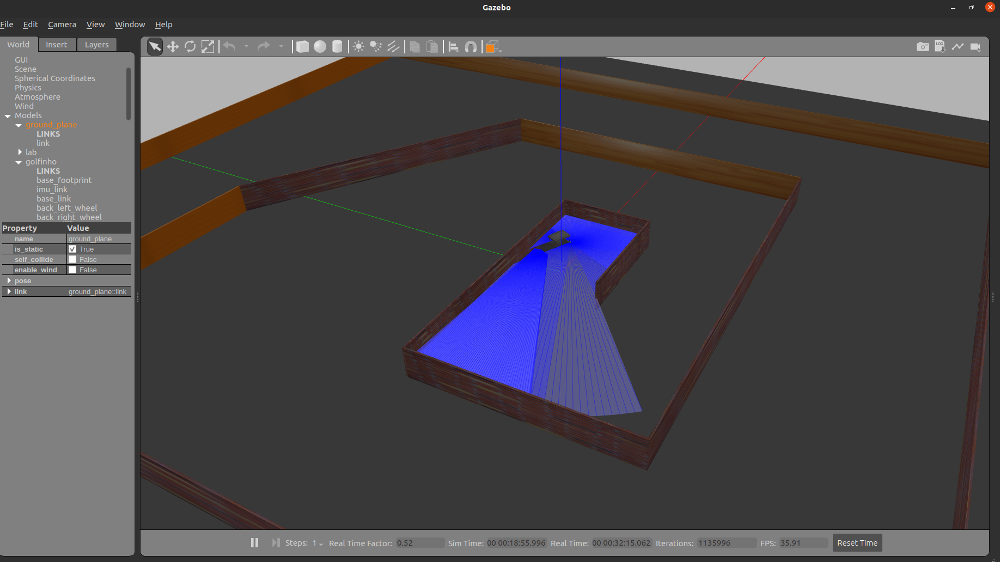
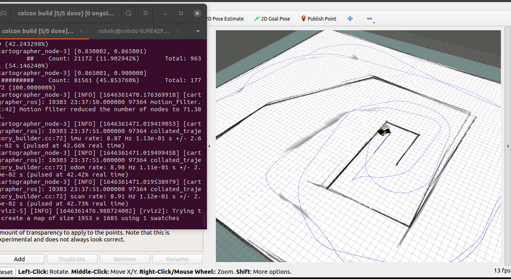
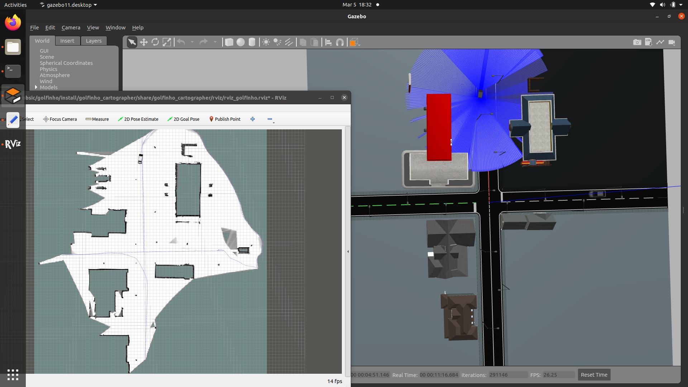
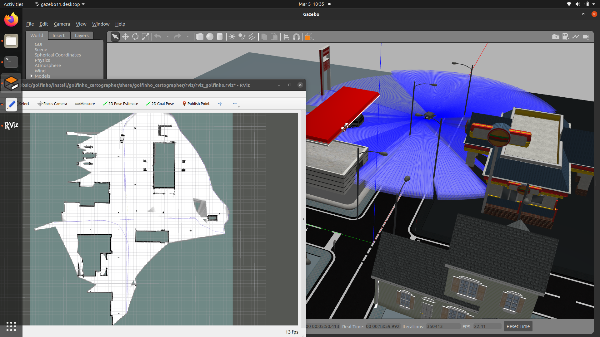
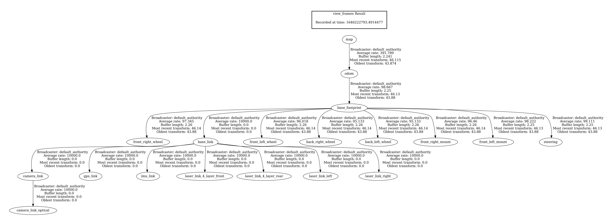
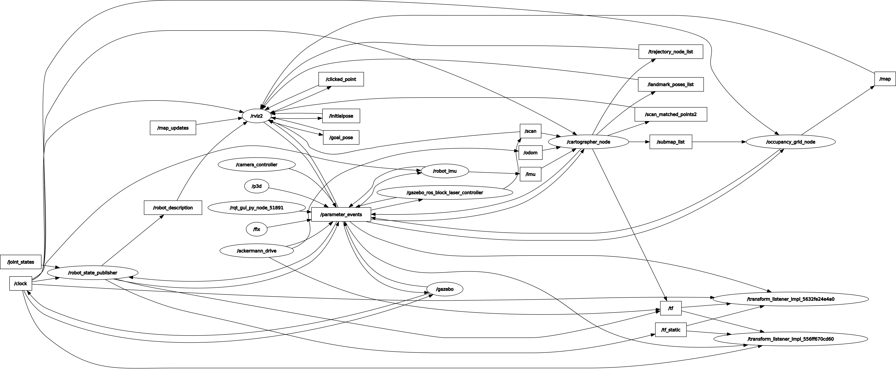

# Golfinho (Cart golf)

## Simulação 1
 
- Gazebo e Rviz

<p align="center" width="100%">
  
  
</p>

## Simulação 2
 
- Gazebo e Rviz

<p align="center" width="100%">
  
  
</p>


- Frames id 



- Nós  e tópicos




## Executando o arquivo de simulação

* Instale o pacote cartographer:
```
sudo apt install ros-foxy-cartographer 
```

* O código abaixo gera uma pasta , clona o repositorio e execulta a simulação:
  
```
git clone https://github.com/Marcos-eca/golfinho.git
cd ~/golfinho
chmod +x depend.sh && ./depend.sh
chmod +x gofinho.sh && ./golfinho.sh
```
* Para executar outros arquivos .sh  basta utilizar o comando "chmod +x arquive.sh" e depois ./arquive.sh para executar o arquivo.
```
#exemplo
chmod +x teleop.sh
./teleop.sh
```
## Carrinho invisível (gazebo)

Caso o carrinho não esteja aparencendo no ambiente gazebo, vá em "src/golfinho_model/model/golfinho_cartographer". Dentro  desta pasta está um arquivo sdf (model.sdf). Troque nas linhas "<uri>adrees.dae</uri>" (localiza os arquivos do modelo visual do carrinho de extensão .dae)  o trecho  do endereço "/home/robsic" pelo endereço
fornecido pelo terminal ao digitar Crtl-Alt-T e escrever a seguinte linha de comando:
```
pwd
```


