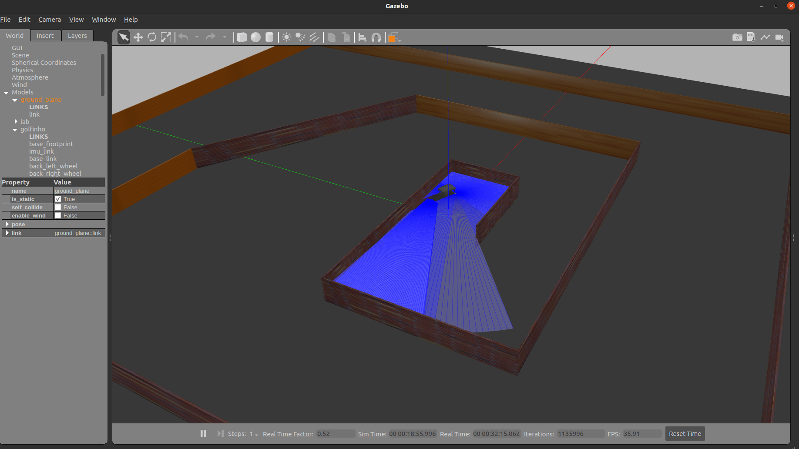
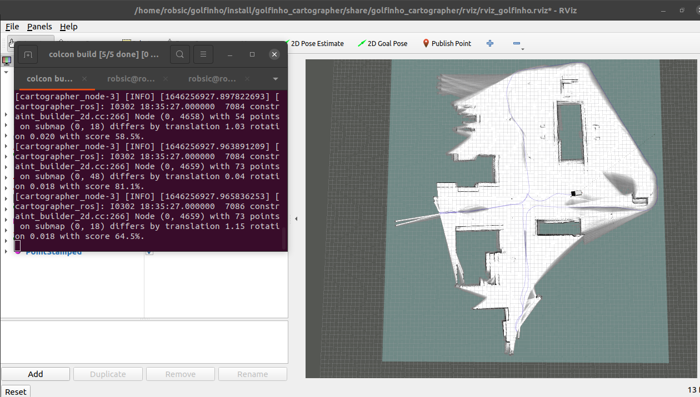

# Golfinho (Cart golf)

## Simulação

- Gazebo



- Rviz



## Executando o arquivo de simulação

* O código abaixo gera uma pasta , clona o repositorio e execulta a simulação:
  
```
mkdir -p ~/Robsic_golfinho/
cd ~/Robsic_golfinho/
git clone https://github.com/Marcos-eca/Robsic-project-in-development-of-an-autonomous-vehicle-golf-cart-ezgo-rxv.git
chmod +x gofinho.sh
./golfinho.sh
```
* Para executar outros arquivos .sh  basta utilizar o comando "chmod +x arquive.sh" e depois ./arquive.sh para executar o arquivo.
```
#exemplo
chmod +x teleop.sh
./teleop.sh
```
## Problema do carrinho não visivel no gazebo

Caso o carrinho não esteja aparencendo no ambiente gazebo, vá em "src/golfinho_model/model/golfinho_cartographer". Dentro  desta pasta está um arquivo sdf (model.sdf). Troque nas linhas "<uri>adrees.dae</uri>" (localiza os arquivos do modelo visual do carrinho de extensão .dae)  o trecho  do endereço "/home/robsic" pelo endereço
fornecido pelo terminal ao digitar Crtl-Alt-T e escrever a seguinte linha de comando:
```
pwd
```


